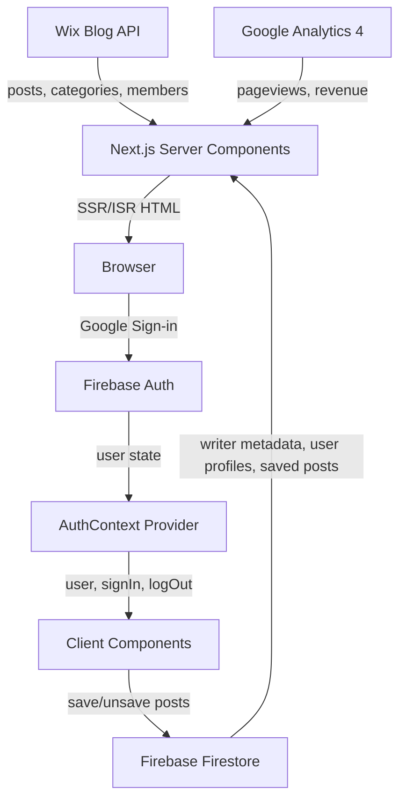

# The Isaander — Frontend Codebase Overview

## What Is It?

**The Isaander** (`theisaander.com`) is a Thai-language investigative news and cultural journalism platform focused on **Isan (อีสาน)** — northeastern Thailand. It positions itself as a creator platform where writers earn revenue share from ads and direct tips.

---

## Tech Stack

| Layer | Technology |
|---|---|
| Framework | **Next.js 16.2.4** (App Router, React 19) |
| Styling | **Tailwind CSS v4** (via `@tailwindcss/postcss`) |
| CMS/Content | **Wix Blog API** (`@wix/blog`, `@wix/sdk`) for posts, categories, members |
| Auth (Readers) | **Firebase Auth** (Google sign-in) + **Firestore** for user profiles & saved posts |
| Auth (Writers) | Custom **JWT-based** auth (`jose` library) with bcrypt passwords, stored in cookies |
| Analytics | **Google Analytics 4** Data API (`@google-analytics/data`) |
| Monetization | **Google AdSense** (lazy-loaded), **PromptPay QR** tips, revenue share model |
| Email | **Resend** (for transactional emails, listed in deps) |
| Icons | **lucide-react** |
| Fonts | **DB Helvethaica X** (local `.woff2` files) |
| Deployment | Likely **Vercel** (Next.js standard) |

---

## Project Structure

```
src/
├── app/                     # Next.js App Router pages
│   ├── layout.tsx           # Root layout — fonts, GA, JSON-LD, AuthProvider
│   ├── page.tsx             # Homepage — hero post, carousel, sidebar writers
│   ├── globals.css          # Tailwind theme + brand colors + rich-content styles
│   ├── post/[slug]/         # Article detail page
│   ├── author/              # Authors list page
│   │   ├── [slug]/          # Individual author profile + revenue card
│   │   └── dashboard/       # Writer dashboard (protected)
│   │       ├── login/       # Dashboard login form
│   │       └── writers/     # Admin writer management
│   ├── explore/             # Category browsing (horizontal scroll cards)
│   ├── search/              # Server-side text search with highlighting
│   ├── saved/               # User's saved posts (Firestore)
│   ├── profile/             # Reader profile + KYC form
│   │   └── apply/           # Writer application form
│   ├── api/
│   │   ├── auth/            # login/logout/me endpoints
│   │   ├── analytics/       # GA4 data for dashboard
│   │   └── admin/writers/   # Admin CRUD for writer metadata
│   ├── rss.xml/             # RSS feed route handler
│   ├── sitemap.ts           # Dynamic sitemap
│   ├── robots.ts            # Robots.txt
│   ├── error.tsx            # Error boundary
│   ├── global-error.tsx     # Root error boundary
│   └── not-found.tsx        # 404 page
├── components/              # 20 React components
├── context/                 # AuthProvider (Firebase Google auth)
├── data/                    # Static author seed data
├── lib/                     # Utilities & services
│   ├── wix-client.ts        # Wix SDK client (posts, categories, members)
│   ├── auth.ts              # JWT create/verify/getSession (writer dashboard)
│   ├── admin-guard.ts       # Admin email whitelist check
│   ├── author-utils.ts      # Complex author resolution + fetchWixWriters
│   ├── analytics.ts         # GA4 Data API client
│   ├── rate-limit.ts        # In-memory sliding window rate limiter
│   ├── utils.ts             # getPostImageUrl, getCategoryLabel, formatDate
│   └── firebase/
│       ├── config.ts        # Client-side Firebase init
│       ├── admin.ts         # Firebase Admin SDK init
│       └── writer-metadata.ts # Firestore CRUD for authors_metadata
└── middleware.ts            # Security headers + writer dashboard auth guard
```

---

## Data Flow Architecture



### Content Pipeline

1. **Wix Blog** is the CMS — posts are authored in Wix and fetched via `@wix/blog` SDK
2. **Author resolution** is complex (3 data sources merged):
   - `src/data/authors.ts` — hardcoded local author config (slug, name, avatar, PromptPay, etc.)
   - **Wix Members API** — fetches profile photos and names
   - **Firestore `authors_metadata`** — dynamic metadata (PromptPay, social links, revenue share %)
3. Priority: Firestore > local config > Wix Members API
4. All data is **cached via `unstable_cache`** with 300s TTL

---

## Authentication — Two Separate Systems

### 1. Reader Auth (Firebase)

- **Google sign-in** via popup (`signInWithPopup`)
- Firebase SDK is **lazy-loaded** (~200 KiB deferred from critical path)
- User profiles stored in Firestore `users/{uid}`
- Saved posts in `users/{uid}/savedPosts/{postId}`
- The `signInWithGoogle` callback is deliberately **synchronous** (no await before popup) to satisfy browser gesture requirements

### 2. Writer Dashboard Auth (JWT)

- Custom login with email/password (bcrypt)
- JWT tokens signed with `HS256` via `jose`
- Stored in `isaander_token` cookie, 7-day expiry
- **Middleware** protects `/author/dashboard/*` routes
- Admin guard via email whitelist (`visarutsankham@gmail.com`)

---

## Monetization Model

### Revenue Share

- Writers get **60%** of AdSense revenue from their articles (configurable per writer)
- Platform keeps 40%
- Revenue displayed on author profile via `RevenueShareCard`
- GA4 Data API fetches actual `totalAdRevenue` and `publisherAdImpressions`
- Falls back to **estimated RPM** (฿30/1000 views) when real data unavailable

### Direct Tipping

- **PromptPay QR codes** generated client-side via `promptpay-qr` + `qrcode`
- 100% goes to writer
- Preset amounts: ฿20, ฿50, ฿100 (or custom)
- Golden-themed modal ("เลี้ยงลาบนักเขียน" — "Buy the writer larb")

### AdSense

- **Lazy-loaded** via IntersectionObserver — script only injects when ad slot nears viewport
- Separate slots: in-article and below-article
- Controlled by env vars (`NEXT_PUBLIC_ENABLE_ADS`, `NEXT_PUBLIC_ADSENSE_CLIENT_ID`)

---

## Key Components Inventory

| Component | Type | Purpose |
|---|---|---|
| `navigation.tsx` | Client | Sticky header + mobile bottom nav (3 items: Home, Explore, Saved) |
| `rich-content.tsx` | Server | Wix RichContent JSON → HTML renderer (paragraphs, headings, images, blockquotes, videos, embeds, link previews) |
| `table-of-contents.tsx` | Client | Desktop sticky sidebar TOC + mobile FAB + bottom sheet drawer |
| `share-button.tsx` | Client | Web Share API / clipboard copy + TipButton + HireButton modals |
| `save-button.tsx` | Client | Bookmark toggle (Firestore) with optimistic UI |
| `promptpay-qr.tsx` | Client | QR code generator for Thai PromptPay payments |
| `revenue-share-card.tsx` | Client | Revenue split visualization (tabbed: yearly/monthly) |
| `tip-section.tsx` | Client | End-of-article tipping CTA with author mini-profile |
| `reading-progress.tsx` | Client | Scroll-linked progress bar (RAF-throttled) |
| `welcome-popup.tsx` | Client | First-visit modal explaining the creator platform model |
| `image-lightbox.tsx` | Client | Click-to-zoom image overlay with focus trap |
| `page-loading.tsx` | Client | Top-of-page indeterminate loading bar on navigation |
| `adsense-slot.tsx` | Client | Lazy-loaded AdSense ad unit with IntersectionObserver |
| `focus-trap.tsx` | Client | Reusable `useFocusTrap` hook for modal accessibility |
| `highlight-text.tsx` | Client | Search query highlighting in results |

---

## Design System

### Brand Colors (Tailwind v4 `@theme`)

| Token | Value | Usage |
|---|---|---|
| `isaander-black` | `#100d0c` | Primary text |
| `isaander-orange` | `#fb512e` | CTA, accent |
| `isaander-dark-red` | `#5e0203` | Deep emphasis |
| `isaander-gold` | `#af8928` | History/heritage badges |
| `isaander-dark-blue` | `#223381` | Writer section |
| `isaander-light-blue` | `#9bacd8` | Subtle backgrounds |
| `isaander-yellow` | `#f2eb67` | Hero category tags |
| `isaander-cream` | `#fffdde` | CTA gradients |
| `isaander-offwhite` | `#f4f1ec` | Surface backgrounds |

### Typography

- **DB Helvethaica X** loaded via `next/font/local` with `display: "optional"` (no CLS)
- Three weights: 400 (regular), 500 (medium), 700 (bold)
- CSS variables: `--font-prompt` and `--font-sarabun` both point to `--font-dbhelvethaica`

### Design Principles (Signal 39 Framework)

- **Rule of Three** — max 3 navigation items, 3 benefit points
- **Breath Rule** — generous whitespace between major content sections
- **Surprisal Audit** — high-impact framing for headlines
- **Drop cap** on first paragraph of articles
- **Brand text selection** — 20% primary color overlay

---

## Performance Optimizations

1. **Firebase lazy loading** — `import()` defers ~200 KiB from critical bundle
2. **AdSense lazy injection** — IntersectionObserver loads script only near viewport
3. **Welcome popup dynamic import** — `next/dynamic` with `ssr: false`
4. **Image optimization** — `image/avif` + `image/webp` formats, 30-day cache, Wix CDN preconnect
5. **Font `display: "optional"`** — eliminates font-swap CLS entirely
6. **ISR with 300s revalidation** on all content pages
7. **Reading progress bar** — RAF-throttled, only updates DOM when value changes by >0.1%
8. **Scroll handlers** use `{ passive: true }` throughout
9. **Package imports optimized** — `lucide-react` and `@wix/sdk` tree-shaken

---

## Security

- **Middleware** applies comprehensive security headers (HSTS, CSP, CORP, X-Frame-Options, etc.)
- **CSP** allows `self`, `https:`, and `unsafe-inline` for scripts/styles
- **URL validation** (`isSafeUrl`) prevents `javascript:` XSS in rich content links
- **Embed whitelist** — only YouTube and Facebook iframes allowed
- **Rate limiting** — in-memory sliding window for API endpoints
- **Admin guard** — email whitelist for writer management endpoints
- **XSS-safe XML** — RSS feed uses proper XML escaping

---

## SEO

- Full `robots.ts` + dynamic `sitemap.ts` (posts + authors)
- JSON-LD: `NewsMediaOrganization` on root, `NewsArticle` on post pages
- OpenGraph + Twitter Card metadata on all pages
- Canonical URLs configured
- `<h1>` per page, semantic HTML throughout
- RSS feed at `/rss.xml`
- Google Site Verification configured
